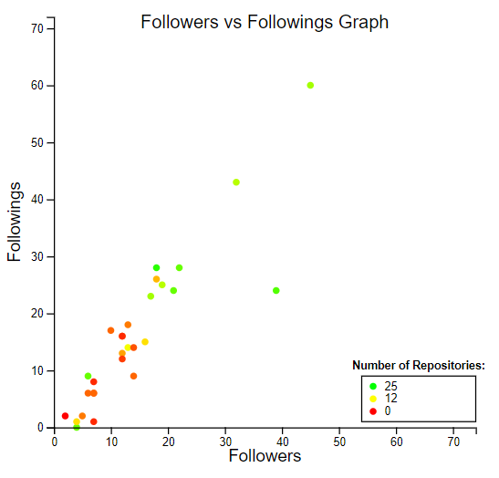

# Github Accecss
*"Interrogate the **GitHub API** to retrieve and display data regarding the logged in developer."*

**Note:** The first part of this project is at commit 2bb2424215902a5b17b448d0437a6ee807f5f20e.

## Stage 1 - Query Github
### About
The project was written in Java within the Eclipse IDE. It uses the [GitHub Java API (org.eclipse.egit.github.core)](https://github.com/eclipse/egit-github/tree/master/org.eclipse.egit.github.core) to query Github for information about the signed in user and everyone they follow, including repositories. It then uses the [Java MongoDB driver](https://docs.mongodb.com/ecosystem/drivers/java/) to populate a MongoDB collection. I used this to populate my MongoDB collection with the accounts that I currently follow.

### How to Use
The source code at this stage of the project can be found in the **Query_Github** folder. The code is not runnable, as it has an outdated password to avoid unwanted writes to the database. However a `.jar` file is provided from an older version of the project, which simply queries data about the logged in user and prints it to the console. To execute it, ensure that you have Java 8 or later installed on your machine. In the console, ensure that you are in the root folder and enter `java -j Github-Access.jar`. You may enter as many names as you want, or `quit` to exit. An example of the output that would be seen when querying my name would include the following:
```
(...)
Repository name: VHDL-Processor
        - Language: VHDL
        - Description: Implementation of a 16-bit, 8 register processor in VHDL.
        - Size: 1740 kB
        - Number of watchers: 0
        - Number of forks: 0
        - Created at: Fri Mar 15 17:17:18 GMT 2019
        - Updated at: Fri Apr 12 13:52:05 BST 2019
        - URL: git://github.com/jackgilbride999/VHDL-Processor.git
Repository name: Yelp-Visualization-Project
        - Language: Java
        - Description: Project to construct an application to explore data on customer reviews of businesses using the processing library for Java.
        - Size: 18149 kB
        - Number of watchers: 2
        - Number of forks: 0
        - Created at: Mon Nov 11 21:30:23 GMT 2019
        - Updated at: Mon Nov 18 12:27:52 GMT 2019
        - URL: git://github.com/jackgilbride999/Yelp-Visualization-Project.git
(...)
```
## Stage 2 - Query MongoDB
### About
The code to query MongoDB was written in Node.js using the [Node.js MongoDB driver](https://docs.mongodb.com/ecosystem/drivers/node/). It queries the data from the previous stage and outputs it as a JSON.

### How to Use
This section of the project is runnable as it uses a read-only API key. To run, navigate to the **Query_Mongo** folder. Ensure that you have Node JS on your machine and enter `npm start` into the console. Sample output from this stage of the project would include the following:
```
(...)
  {
    _id: 5de19cb8714b675b72b00e33,
    login: 'jackgilbride999',
    followers: 22,
    following: 28,
    repositories: [
      [Object], [Object], [Object],
      [Object], [Object], [Object],
      [Object], [Object], [Object],
      [Object], [Object], [Object],
      [Object], [Object], [Object],
      [Object], [Object], [Object],
      [Object], [Object]
    ]
  }
(...)
```

## Stage 3 - Visualize the Data
### About
The visualization of data was written using the [D3 data visualization library for Javascript](https://github.com/d3/d3). I created two visualizations:
- Number of followers vs number of followings, and their correlation to number of repositories
- Breakdown of a user's repository list by language

### How to Use
For ease of use, both visualizations are fully encapsulated into their own HTML file. Navigate to the **Visualizations** folder and open them in a web browser. The files appear as follows:
- *Followers vs following* (mouse over a user to see their username). Interestingly, this shows a strong combination between number of followers, number of followings and number of repositories. It could be argued that a person's position on the graph determines their engagement with Github, at least publicly:



- *Language breakdown* (press the button on the top left to cycle through users):


